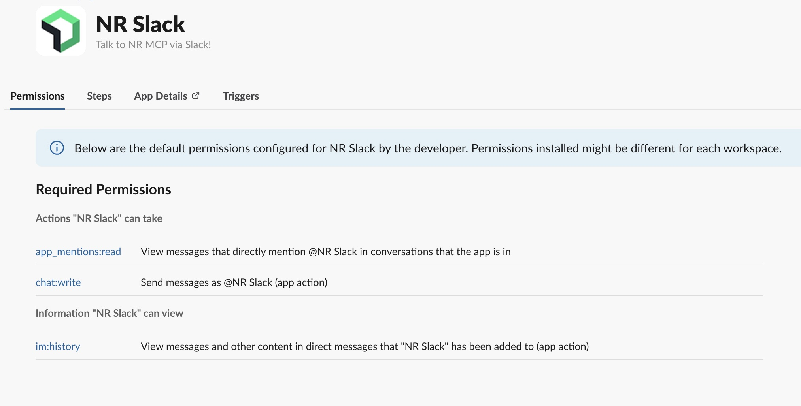

# NR MCP Slack App

A simple Slack app that can be configured and run locally. This project uses environment variables for your Slack app credentials, so please copy the example `.env.example` file and rename it to `.env` before starting.

## Quick Start

1. Copy and rename the environment file:

   ```bash
   cp .env.example .env
   ```

2. Open `.env` and fill in the Slack configuration values with the correct tokens and secrets. Refer to ["How to Get Slack Tokens and Secrets"](#how-to-get-slack-tokens-and-secrets) below for more information.

3. Install dependencies:

   ```bash
   npm install
   ```

4. Start the app:

   ```bash
   node app.js
   ```

## Environment Variables

The `.env` file should contain the Slack app credentials that the project needs. Typical variables include:

- `SLACK_SIGNING_SECRET` - Your Slack app signing secret.
- `SLACK_BOT_TOKEN` - The Bot User OAuth token (usually starts with `xoxb-`).
- `SLACK_APP_TOKEN` - The App-Level Token used for socket mode (usually starts with `xapp-`).
- Any other custom variables your app uses.

> Make sure you duplicate `.env.example` and rename it to `.env`, then fill in all required values before running the app.

## How to Get Slack Tokens and Secrets

1. Go to the Slack API dashboard:
   - https://api.slack.com/apps

2. Create a new Slack app or select your existing app.

3. Add features and functionality
   - Enable "Bot Token Scopes" and add the permissions your bot needs.
   
   - Enable socket mode if your app uses it, then create an App-Level Token.

4. Install the app to your workspace
   - After adding scopes, install the app to your workspace to generate the Bot Token.

5. Copy the credentials into your `.env` file
   - `SLACK_SIGNING_SECRET` from the "Basic Information" page.
   - `SLACK_BOT_TOKEN` from the "OAuth & Permissions" page.
   - `SLACK_APP_TOKEN` from the "App-Level Tokens" section if using socket mode.

## Slack Documentation

- Slack app basics: https://api.slack.com/start
- Creating a Slack app: https://api.slack.com/apps
- OAuth & Permissions: https://api.slack.com/authentication/oauth-v2
- Signing secrets: https://api.slack.com/authentication/verifying-requests-from-slack
- Socket Mode: https://api.slack.com/apis/connections/socket-mode

## Running Locally

If your app receives events from Slack, make sure you expose your local server to Slack if needed.

Common tools for local testing:

- `ngrok` - https://ngrok.com/
- `localtunnel` - https://localtunnel.me/

## Notes

- Never commit your `.env` file to version control.
- Keep your Slack app credentials private.
- Update the `.env.example` file if you add more configuration keys in the future.
